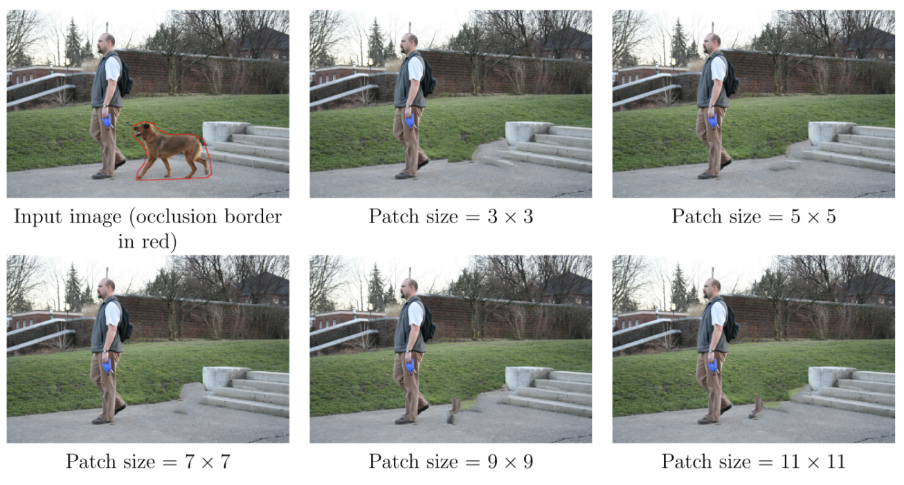
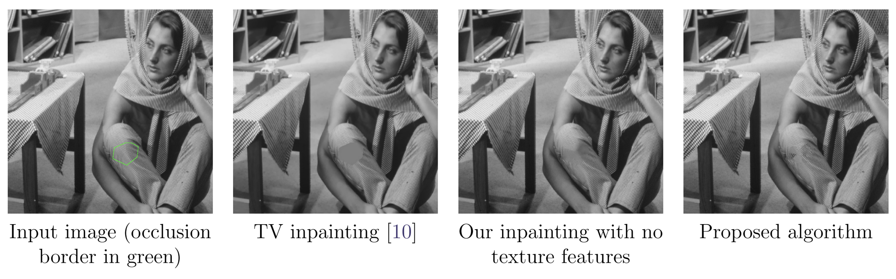

```{r wrap-hook, echo=FALSE}
library(knitr)
hook_output = knit_hooks$get('output')
knit_hooks$set(output = function(x, options) {
  # this hook is used only when the linewidth option is not NULL
  if (!is.null(n <- options$linewidth)) {
    x = knitr:::split_lines(x)
    # any lines wider than n should be wrapped
    if (any(nchar(x) > n)) x = strwrap(x, width = n)
    x = paste(x, collapse = '\n')
  }
  hook_output(x, options)
})
```

## Introduction
The goal of Image inpainting is to fill in the missing regions of an image in a sophisticated and plausible way. There are several existing image processing packages already available in R that offers quite useful image editing and processing techniques such as ImageR, Magick, and EBImage but they lack proper implementation of Image inpainting algorithms. This package tries to fill that gap by providing R users the ability to utilize a recent C/C++ based library that performs "Non-Local Patch-Based Image Inpainting" on images.

Based on the research of Alasdir et al. [1], a patch based image inpainting is possible that smoothly applies patches and can also match patterns and texture in the nearest areas to the occlusion area. An occlusion area is the the region where image inpainting is applied.

The whole C/C++ library code base was tweaked to comply with `Rcpp` package's guidelines. Some of them are to use `Rcout` instead of `cout`, `Rprintf` instead of `printf` and to use R's random number generators instead of C/C++'s `rand` and `seed` functions, among others. Library's main method was exposed using `[Rcpp::export]` attribute and the return values were provided to R code using `Rccp`'s list data structure.

## Algorithm Inputs

The algorithm takes two images, one being the actual input image and the second with the occlusion area applied. Background of the second image is blacked out such that only the occlusion area remains white, which also really helps in extracting the occlusion area in the R package. Rest of the arguments control how the algorithm behaves and those include 
1.  `patchSizeX` : Size of X patch, which can be between 3L to 13L. 7L is most suitable for images between 512x512 to 800x800 pixels and hence it is the default value
2.  `patchSizeY` : Size of Y patch, which can be between 3L to 13L. 7L is most suitable for images between 512x512 to 800x800 pixels and hence it is the default value
3. `nLevels` : Number of pyramid levels (0-15). Defaults to automatic selection by the algorithm
4. `useFeatures` : A boolean value, the algorithm also matches the region's texture if this is set to true or 1
5. `verboseMode` : Enables or disables the verbose mode

## Sample Inpainting

By using the patch size of `7L` by `7L`, following image inpainting outputs were obtained [1]

{width=700px}

As can be seen that `7x7` is the ideal patch size for regular sized images. The affect of use features argument triggers whether the algorithm should match texture or only apply a solid patch, see image below.

{width=700px}


## R interface
Beside providing an ability to call C/C++ image inpainting function, the motive of this package was to effectively apply and analyze the results using well known R functions such as `plot` and `print`, etc. We provide two R classes, `inpaint` and `occlusion`. The `inpaint` class holds a list structure of input images, output images, their paths and, algorithm parameters. Plotting, printing and summarizing this class is enabled by providing custom implementation based on their respective functions. 

Whereas, the `occlusion` class extracts the occlusion regions from the occlusion input image provided by the user and then extracts the same regions from input and output images, to finally plot them.

## Usage

First call the `imageInpaint` functions which eventually calls the C/C++ library function in the background

```{r}
library(imageInpainting)

inputFile = system.file("extdata", "car.png", package = "imageInpainting")
inputOccFile = system.file("extdata", "car_occlusion.png", package = "imageInpainting")
outputFilePath = file.path(getwd(), "car_inpainted.png")

inpaintResult = imageInpaint(inputFile, inputOccFile, outputFilePath)
```

If we print the `inpaintResult`, our own `S3` implementation of `print` method is called

```{r}
print(inpaintResult)
```

Summary of the `inpaintResult` is also available in matrix form

```{r linewidth=60}
summary(inpaintResult)
```

To view the inpainted output image alongside input and occlusion images, call the plot function as 

```{r fig.height=8, fig.width=6}
plot(inpaintResult)
```

Now to extract the occlusion regions, call `extractOcclusionRegions` method and plot the result as below

```{r fig.height=8, fig.width=6}
regions <- extractOcclusionRegions(inpaintResult)
plot(regions)
```

## References
1. Newson, A., Almansa, A., Gousseau, Y., & Pérez, P. (2017). Non-local patch-based image inpainting. Image Processing On Line, 7, 373-385.
